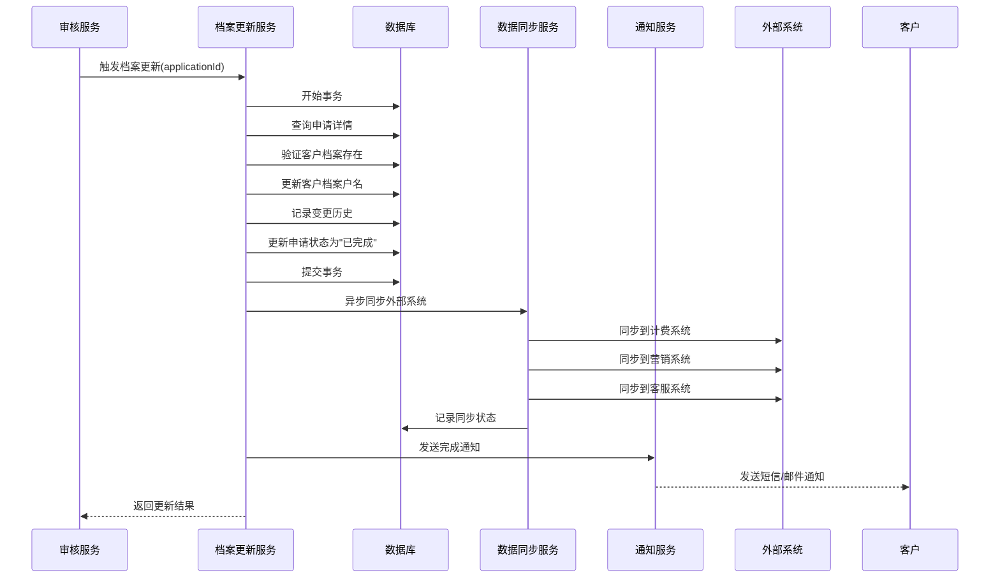

# 用户故事 3: 系统自动更新客户档案 - 详细设计

## 1. 概述

### 1.1 用户故事
**作为** 系统管理员  
**我希望** 系统能够自动更新通过审核的客户档案  
**以便于** 确保客户信息的及时更新和数据一致性  

### 1.2 业务目标
- 自动化客户档案更新流程
- 确保数据一致性和完整性
- 提供完整的变更历史记录
- 支持跨系统数据同步

## 2. 功能需求分析

### 2.1 核心功能
1. **自动触发更新**: 审核通过后自动启动档案更新流程
2. **事务性更新**: 保证更新操作的原子性
3. **历史记录**: 完整记录户名变更历史
4. **状态管理**: 更新申请和档案状态
5. **通知机制**: 向客户发送完成通知
6. **系统同步**: 同步相关业务系统数据

### 2.2 非功能需求
- **性能**: 单次更新操作不超过3秒
- **可靠性**: 99.9%成功率，失败自动重试
- **一致性**: 强一致性要求，使用分布式事务
- **可扩展性**: 支持批量更新和异步处理
- **安全性**: 操作日志记录和权限控制

## 3. 系统架构设计

### 3.1 整体架构
```
┌─────────────────┐    ┌─────────────────┐    ┌─────────────────┐
│   审核服务      │───▶│  档案更新服务   │───▶│   通知服务      │
│  (Audit API)   │    │(Profile Update) │    │(Notification)   │
└─────────────────┘    └─────────────────┘    └─────────────────┘
                                │
                                ▼
                       ┌─────────────────┐
                       │   数据同步服务  │
                       │ (Data Sync API) │
                       └─────────────────┘
                                │
                    ┌───────────┼───────────┐
                    ▼           ▼           ▼
            ┌─────────────┐ ┌─────────────┐ ┌─────────────┐
            │  计费系统   │ │  营销系统   │ │  客服系统   │
            │   (CRM)     │ │   (CMS)     │ │   (CSS)     │
            └─────────────┘ └─────────────┘ └─────────────┘
```

### 3.2 核心组件

#### 3.2.1 档案更新服务 (Profile Update Service)
```typescript
interface ProfileUpdateService {
  // 主要更新流程
  updateCustomerProfile(applicationId: string): Promise<UpdateResult>;
  
  // 事务管理
  executeTransaction(operations: Operation[]): Promise<TransactionResult>;
  
  // 历史记录
  recordNameChangeHistory(changeData: NameChangeRecord): Promise<void>;
  
  // 状态更新
  updateApplicationStatus(applicationId: string, status: ApplicationStatus): Promise<void>;
}
```

#### 3.2.2 数据同步服务 (Data Sync Service)
```typescript
interface DataSyncService {
  // 同步到外部系统
  syncToExternalSystems(customerId: string, updateData: ProfileUpdate): Promise<SyncResult[]>;
  
  // 重试机制
  retryFailedSync(syncId: string): Promise<SyncResult>;
  
  // 同步状态查询
  getSyncStatus(customerId: string): Promise<SyncStatus[]>;
}
```

## 4. 数据模型设计

### 4.1 客户档案表 (customer_profiles)
```sql
CREATE TABLE customer_profiles (
    id BIGINT PRIMARY KEY AUTO_INCREMENT,
    customer_id VARCHAR(50) UNIQUE NOT NULL COMMENT '客户编号',
    customer_name VARCHAR(100) NOT NULL COMMENT '客户户名',
    contact_phone VARCHAR(20) COMMENT '联系电话',
    contact_address TEXT COMMENT '联系地址',
    account_type ENUM('residential', 'commercial', 'industrial') COMMENT '账户类型',
    status ENUM('active', 'inactive', 'suspended') DEFAULT 'active',
    created_at TIMESTAMP DEFAULT CURRENT_TIMESTAMP,
    updated_at TIMESTAMP DEFAULT CURRENT_TIMESTAMP ON UPDATE CURRENT_TIMESTAMP,
    version INT DEFAULT 1 COMMENT '版本号，用于乐观锁'
);

CREATE INDEX idx_customer_profiles_customer_id ON customer_profiles(customer_id);
CREATE INDEX idx_customer_profiles_name ON customer_profiles(customer_name);
```

### 4.2 户名变更历史表 (name_change_history)
```sql
CREATE TABLE name_change_history (
    id BIGINT PRIMARY KEY AUTO_INCREMENT,
    customer_id VARCHAR(50) NOT NULL COMMENT '客户编号',
    application_id VARCHAR(50) NOT NULL COMMENT '申请编号',
    old_name VARCHAR(100) NOT NULL COMMENT '原户名',
    new_name VARCHAR(100) NOT NULL COMMENT '新户名',
    change_reason TEXT COMMENT '变更原因',
    change_date TIMESTAMP DEFAULT CURRENT_TIMESTAMP COMMENT '变更时间',
    operator_id VARCHAR(50) COMMENT '操作员ID',
    operator_name VARCHAR(50) COMMENT '操作员姓名',
    
    FOREIGN KEY (customer_id) REFERENCES customer_profiles(customer_id),
    FOREIGN KEY (application_id) REFERENCES name_change_applications(id)
);

CREATE INDEX idx_name_change_history_customer_id ON name_change_history(customer_id);
CREATE INDEX idx_name_change_history_application_id ON name_change_history(application_id);
CREATE INDEX idx_name_change_history_change_date ON name_change_history(change_date);
```

### 4.3 外部系统同步记录表 (external_sync_records)
```sql
CREATE TABLE external_sync_records (
    id BIGINT PRIMARY KEY AUTO_INCREMENT,
    customer_id VARCHAR(50) NOT NULL COMMENT '客户编号',
    application_id VARCHAR(50) NOT NULL COMMENT '申请编号',
    system_code VARCHAR(20) NOT NULL COMMENT '外部系统代码',
    system_name VARCHAR(50) NOT NULL COMMENT '外部系统名称',
    sync_status ENUM('pending', 'success', 'failed', 'retrying') DEFAULT 'pending',
    sync_data JSON COMMENT '同步数据',
    error_message TEXT COMMENT '错误信息',
    retry_count INT DEFAULT 0 COMMENT '重试次数',
    max_retry_count INT DEFAULT 3 COMMENT '最大重试次数',
    created_at TIMESTAMP DEFAULT CURRENT_TIMESTAMP,
    updated_at TIMESTAMP DEFAULT CURRENT_TIMESTAMP ON UPDATE CURRENT_TIMESTAMP,
    
    FOREIGN KEY (customer_id) REFERENCES customer_profiles(customer_id),
    FOREIGN KEY (application_id) REFERENCES name_change_applications(id)
);

CREATE INDEX idx_external_sync_customer_id ON external_sync_records(customer_id);
CREATE INDEX idx_external_sync_status ON external_sync_records(sync_status);
```

## 5. 详细流程设计

### 5.1 主流程时序图


### 5.2 核心算法实现

#### 5.2.1 档案更新主流程
```typescript
export class ProfileUpdateService {
  async updateCustomerProfile(applicationId: string): Promise<UpdateResult> {
    const transaction = await this.db.beginTransaction();
    
    try {
      // 1. 查询申请详情
      const application = await this.getApplication(applicationId);
      if (!application) {
        throw new Error(`Application not found: ${applicationId}`);
      }
      
      // 2. 验证申请状态
      if (application.status !== 'approved') {
        throw new Error(`Invalid application status: ${application.status}`);
      }
      
      // 3. 查询客户档案
      const profile = await this.getCustomerProfile(application.customerId);
      if (!profile) {
        throw new Error(`Customer profile not found: ${application.customerId}`);
      }
      
      // 4. 验证乐观锁
      if (profile.version !== application.profileVersion) {
        throw new Error('Profile has been modified by another process');
      }
      
      // 5. 更新客户档案
      const updateData = {
        customer_name: application.newName,
        updated_at: new Date(),
        version: profile.version + 1
      };
      
      await this.updateProfile(application.customerId, updateData, transaction);
      
      // 6. 记录变更历史
      const historyRecord = {
        customer_id: application.customerId,
        application_id: applicationId,
        old_name: application.oldName,
        new_name: application.newName,
        change_reason: application.reason,
        operator_id: 'system',
        operator_name: 'Auto System'
      };
      
      await this.recordNameChangeHistory(historyRecord, transaction);
      
      // 7. 更新申请状态
      await this.updateApplicationStatus(applicationId, 'completed', transaction);
      
      // 8. 提交事务
      await transaction.commit();
      
      // 9. 异步处理后续操作
      this.processPostUpdateTasks(applicationId, application.customerId);
      
      return {
        success: true,
        applicationId,
        customerId: application.customerId,
        oldName: application.oldName,
        newName: application.newName,
        updateTime: new Date()
      };
      
    } catch (error) {
      await transaction.rollback();
      
      // 记录错误日志
      await this.logError(applicationId, error);
      
      // 更新申请状态为错误
      await this.updateApplicationStatus(applicationId, 'update_failed');
      
      throw error;
    }
  }
  
  private async processPostUpdateTasks(applicationId: string, customerId: string): Promise<void> {
    try {
      // 异步同步外部系统
      await this.dataSyncService.syncToExternalSystems(customerId, {
        applicationId,
        updateType: 'name_change'
      });
      
      // 发送完成通知
      await this.notificationService.sendUpdateCompleteNotification(applicationId);
      
    } catch (error) {
      // 后续任务失败不影响主流程，记录日志即可
      console.error('Post update task failed:', error);
      await this.logError(applicationId, error, 'post_update_task');
    }
  }
}
```

#### 5.2.2 外部系统同步逻辑
```typescript
export class DataSyncService {
  private readonly externalSystems = [
    { code: 'CRM', name: '计费系统', endpoint: '/api/customer/update' },
    { code: 'CMS', name: '营销系统', endpoint: '/api/profile/sync' },
    { code: 'CSS', name: '客服系统', endpoint: '/api/customer/profile' }
  ];
  
  async syncToExternalSystems(customerId: string, updateData: ProfileUpdate): Promise<SyncResult[]> {
    const results: SyncResult[] = [];
    
    // 并行同步所有外部系统
    const syncPromises = this.externalSystems.map(system => 
      this.syncToSingleSystem(system, customerId, updateData)
    );
    
    const syncResults = await Promise.allSettled(syncPromises);
    
    // 处理同步结果
    for (let i = 0; i < syncResults.length; i++) {
      const result = syncResults[i];
      const system = this.externalSystems[i];
      
      if (result.status === 'fulfilled') {
        results.push(result.value);
      } else {
        // 同步失败，记录错误并安排重试
        const errorResult = {
          systemCode: system.code,
          systemName: system.name,
          customerId,
          status: 'failed' as const,
          error: result.reason.message,
          retryCount: 0
        };
        
        results.push(errorResult);
        
        // 记录同步失败记录
        await this.recordSyncFailure(errorResult, updateData);
        
        // 安排重试
        await this.scheduleRetry(errorResult);
      }
    }
    
    return results;
  }
  
  private async syncToSingleSystem(
    system: ExternalSystem, 
    customerId: string, 
    updateData: ProfileUpdate
  ): Promise<SyncResult> {
    const syncRecord = await this.createSyncRecord(system.code, customerId, updateData);
    
    try {
      const response = await this.httpClient.post(system.endpoint, {
        customerId,
        updateData,
        timestamp: new Date().toISOString()
      });
      
      if (response.status === 200) {
        await this.updateSyncRecord(syncRecord.id, 'success');
        
        return {
          systemCode: system.code,
          systemName: system.name,
          customerId,
          status: 'success',
          syncTime: new Date()
        };
      } else {
        throw new Error(`HTTP ${response.status}: ${response.statusText}`);
      }
      
    } catch (error) {
      await this.updateSyncRecord(syncRecord.id, 'failed', error.message);
      throw error;
    }
  }
  
  async retryFailedSync(syncId: string): Promise<SyncResult> {
    const record = await this.getSyncRecord(syncId);
    
    if (!record) {
      throw new Error(`Sync record not found: ${syncId}`);
    }
    
    if (record.retry_count >= record.max_retry_count) {
      throw new Error(`Max retry count exceeded for sync: ${syncId}`);
    }
    
    // 增加重试次数
    await this.incrementRetryCount(syncId);
    
    // 执行重试
    const system = this.externalSystems.find(s => s.code === record.system_code);
    if (!system) {
      throw new Error(`Unknown system code: ${record.system_code}`);
    }
    
    return await this.syncToSingleSystem(system, record.customer_id, record.sync_data);
  }
}
```

## 6. 异常处理设计

### 6.1 异常分类
```typescript
export enum UpdateErrorType {
  APPLICATION_NOT_FOUND = 'APPLICATION_NOT_FOUND',
  INVALID_STATUS = 'INVALID_STATUS',
  PROFILE_NOT_FOUND = 'PROFILE_NOT_FOUND',
  CONCURRENCY_CONFLICT = 'CONCURRENCY_CONFLICT',
  DATABASE_ERROR = 'DATABASE_ERROR',
  EXTERNAL_SYNC_ERROR = 'EXTERNAL_SYNC_ERROR',
  NOTIFICATION_ERROR = 'NOTIFICATION_ERROR'
}

export class UpdateError extends Error {
  constructor(
    public type: UpdateErrorType,
    public applicationId: string,
    message: string,
    public originalError?: Error
  ) {
    super(message);
    this.name = 'UpdateError';
  }
}
```

### 6.2 错误处理策略
```typescript
export class ErrorHandler {
  async handleUpdateError(error: UpdateError): Promise<ErrorHandlingResult> {
    switch (error.type) {
      case UpdateErrorType.APPLICATION_NOT_FOUND:
      case UpdateErrorType.PROFILE_NOT_FOUND:
        // 数据不存在错误，记录日志但不重试
        await this.logError(error, 'FATAL');
        return { shouldRetry: false, action: 'LOG_ONLY' };
        
      case UpdateErrorType.INVALID_STATUS:
        // 状态错误，需要人工介入
        await this.logError(error, 'ERROR');
        await this.notifyAdmin(error);
        return { shouldRetry: false, action: 'MANUAL_INTERVENTION' };
        
      case UpdateErrorType.CONCURRENCY_CONFLICT:
        // 并发冲突，可以重试
        await this.logError(error, 'WARN');
        return { shouldRetry: true, retryDelay: 1000, maxRetries: 3 };
        
      case UpdateErrorType.DATABASE_ERROR:
        // 数据库错误，重试有限次数
        await this.logError(error, 'ERROR');
        return { shouldRetry: true, retryDelay: 5000, maxRetries: 2 };
        
      case UpdateErrorType.EXTERNAL_SYNC_ERROR:
        // 外部同步错误，后台重试
        await this.logError(error, 'WARN');
        await this.scheduleBackgroundRetry(error);
        return { shouldRetry: false, action: 'BACKGROUND_RETRY' };
        
      default:
        // 未知错误，记录并通知管理员
        await this.logError(error, 'ERROR');
        await this.notifyAdmin(error);
        return { shouldRetry: false, action: 'MANUAL_INTERVENTION' };
    }
  }
}
```

## 7. 性能优化设计

### 7.1 数据库优化
```sql
-- 为高频查询添加复合索引
CREATE INDEX idx_applications_status_customer ON name_change_applications(status, customer_id);
CREATE INDEX idx_profiles_customer_version ON customer_profiles(customer_id, version);

-- 分区表设计（按月分区）
CREATE TABLE name_change_history_202507 PARTITION OF name_change_history
FOR VALUES FROM ('2025-07-01') TO ('2025-08-01');
```

### 7.2 缓存策略
```typescript
export class CacheService {
  private redis = new Redis(process.env.REDIS_URL);
  
  async getCachedProfile(customerId: string): Promise<CustomerProfile | null> {
    const cached = await this.redis.get(`profile:${customerId}`);
    return cached ? JSON.parse(cached) : null;
  }
  
  async setCachedProfile(customerId: string, profile: CustomerProfile): Promise<void> {
    await this.redis.setex(`profile:${customerId}`, 300, JSON.stringify(profile));
  }
  
  async invalidateProfileCache(customerId: string): Promise<void> {
    await this.redis.del(`profile:${customerId}`);
  }
}
```

### 7.3 异步处理
```typescript
export class AsyncProcessor {
  private queue = new Bull('profile-update', {
    redis: { host: 'localhost', port: 6379 }
  });
  
  constructor() {
    this.queue.process('sync-external', this.processSyncJob.bind(this));
    this.queue.process('send-notification', this.processNotificationJob.bind(this));
  }
  
  async scheduleExternalSync(customerId: string, updateData: ProfileUpdate): Promise<void> {
    await this.queue.add('sync-external', { customerId, updateData }, {
      attempts: 3,
      backoff: 'exponential',
      delay: 1000
    });
  }
  
  async scheduleNotification(applicationId: string): Promise<void> {
    await this.queue.add('send-notification', { applicationId }, {
      attempts: 5,
      backoff: 'fixed',
      delay: 2000
    });
  }
}
```

## 8. 监控和日志设计

### 8.1 关键指标监控
```typescript
export class MetricsCollector {
  private prometheus = new PrometheusMetrics();
  
  // 更新成功率
  updateSuccessRate = new this.prometheus.Counter({
    name: 'profile_update_success_total',
    help: 'Total number of successful profile updates',
    labelNames: ['customer_type']
  });
  
  // 更新响应时间
  updateDuration = new this.prometheus.Histogram({
    name: 'profile_update_duration_seconds',
    help: 'Duration of profile update operations',
    buckets: [0.1, 0.5, 1, 2, 5]
  });
  
  // 外部系统同步状态
  externalSyncStatus = new this.prometheus.Gauge({
    name: 'external_sync_status',
    help: 'Status of external system synchronization',
    labelNames: ['system_code', 'status']
  });
  
  recordUpdateSuccess(customerType: string): void {
    this.updateSuccessRate.inc({ customer_type: customerType });
  }
  
  recordUpdateDuration(duration: number): void {
    this.updateDuration.observe(duration);
  }
}
```

### 8.2 结构化日志
```typescript
export class StructuredLogger {
  private logger = winston.createLogger({
    format: winston.format.combine(
      winston.format.timestamp(),
      winston.format.json()
    ),
    transports: [
      new winston.transports.File({ filename: 'profile-update.log' }),
      new winston.transports.Console()
    ]
  });
  
  logUpdateStart(applicationId: string, customerId: string): void {
    this.logger.info('Profile update started', {
      event: 'UPDATE_START',
      applicationId,
      customerId,
      timestamp: new Date().toISOString()
    });
  }
  
  logUpdateSuccess(applicationId: string, customerId: string, duration: number): void {
    this.logger.info('Profile update completed', {
      event: 'UPDATE_SUCCESS',
      applicationId,
      customerId,
      duration,
      timestamp: new Date().toISOString()
    });
  }
  
  logUpdateError(applicationId: string, error: Error): void {
    this.logger.error('Profile update failed', {
      event: 'UPDATE_ERROR',
      applicationId,
      error: error.message,
      stack: error.stack,
      timestamp: new Date().toISOString()
    });
  }
}
```

## 9. 安全设计

### 9.1 数据加密
```typescript
export class DataEncryption {
  private algorithm = 'aes-256-gcm';
  private key = Buffer.from(process.env.ENCRYPTION_KEY, 'hex');
  
  encryptSensitiveData(data: string): EncryptedData {
    const iv = crypto.randomBytes(16);
    const cipher = crypto.createCipher(this.algorithm, this.key);
    cipher.setAAD(Buffer.from('profile-update', 'utf8'));
    
    let encrypted = cipher.update(data, 'utf8', 'hex');
    encrypted += cipher.final('hex');
    
    const authTag = cipher.getAuthTag();
    
    return {
      encrypted,
      iv: iv.toString('hex'),
      authTag: authTag.toString('hex')
    };
  }
  
  decryptSensitiveData(encryptedData: EncryptedData): string {
    const decipher = crypto.createDecipher(this.algorithm, this.key);
    decipher.setAuthTag(Buffer.from(encryptedData.authTag, 'hex'));
    decipher.setAAD(Buffer.from('profile-update', 'utf8'));
    
    let decrypted = decipher.update(encryptedData.encrypted, 'hex', 'utf8');
    decrypted += decipher.final('utf8');
    
    return decrypted;
  }
}
```

### 9.2 审计日志
```sql
CREATE TABLE audit_logs (
    id BIGINT PRIMARY KEY AUTO_INCREMENT,
    event_type VARCHAR(50) NOT NULL COMMENT '事件类型',
    user_id VARCHAR(50) COMMENT '操作用户ID',
    customer_id VARCHAR(50) COMMENT '客户编号',
    application_id VARCHAR(50) COMMENT '申请编号',
    operation VARCHAR(100) NOT NULL COMMENT '操作描述',
    old_value JSON COMMENT '原值',
    new_value JSON COMMENT '新值',
    ip_address VARCHAR(45) COMMENT 'IP地址',
    user_agent TEXT COMMENT '用户代理',
    event_time TIMESTAMP DEFAULT CURRENT_TIMESTAMP,
    
    INDEX idx_audit_logs_event_type (event_type),
    INDEX idx_audit_logs_user_id (user_id),
    INDEX idx_audit_logs_customer_id (customer_id),
    INDEX idx_audit_logs_event_time (event_time)
);
```

## 10. 部署和运维

### 10.1 Docker配置
```dockerfile
FROM node:18-alpine

WORKDIR /app

COPY package*.json ./
RUN npm ci --only=production

COPY dist/ ./dist/
COPY config/ ./config/

EXPOSE 3000

HEALTHCHECK --interval=30s --timeout=10s --start-period=5s --retries=3 \
  CMD curl -f http://localhost:3000/health || exit 1

CMD ["node", "dist/index.js"]
```

### 10.2 Kubernetes部署
```yaml
apiVersion: apps/v1
kind: Deployment
metadata:
  name: profile-update-service
spec:
  replicas: 3
  selector:
    matchLabels:
      app: profile-update-service
  template:
    metadata:
      labels:
        app: profile-update-service
    spec:
      containers:
      - name: profile-update-service
        image: profile-update-service:latest
        ports:
        - containerPort: 3000
        env:
        - name: DB_HOST
          valueFrom:
            secretKeyRef:
              name: db-secret
              key: host
        - name: REDIS_URL
          valueFrom:
            configMapKeyRef:
              name: app-config
              key: redis-url
        resources:
          requests:
            memory: "256Mi"
            cpu: "100m"
          limits:
            memory: "512Mi"
            cpu: "500m"
        livenessProbe:
          httpGet:
            path: /health
            port: 3000
          initialDelaySeconds: 30
          periodSeconds: 10
        readinessProbe:
          httpGet:
            path: /ready
            port: 3000
          initialDelaySeconds: 5
          periodSeconds: 5
```

## 11. 测试策略

### 11.1 单元测试
```typescript
describe('ProfileUpdateService', () => {
  let service: ProfileUpdateService;
  let mockDb: jest.Mocked<Database>;
  
  beforeEach(() => {
    mockDb = createMockDatabase();
    service = new ProfileUpdateService(mockDb);
  });
  
  describe('updateCustomerProfile', () => {
    it('should successfully update customer profile', async () => {
      // Arrange
      const applicationId = 'APP123';
      const mockApplication = {
        id: applicationId,
        customerId: 'CUST001',
        oldName: '张三',
        newName: '李四',
        status: 'approved'
      };
      
      mockDb.getApplication.mockResolvedValue(mockApplication);
      mockDb.getCustomerProfile.mockResolvedValue({
        customer_id: 'CUST001',
        customer_name: '张三',
        version: 1
      });
      
      // Act
      const result = await service.updateCustomerProfile(applicationId);
      
      // Assert
      expect(result.success).toBe(true);
      expect(result.newName).toBe('李四');
      expect(mockDb.updateProfile).toHaveBeenCalledWith(
        'CUST001',
        expect.objectContaining({
          customer_name: '李四',
          version: 2
        }),
        expect.any(Object)
      );
    });
    
    it('should handle concurrency conflict', async () => {
      // Arrange
      const applicationId = 'APP123';
      mockDb.getApplication.mockResolvedValue({
        id: applicationId,
        customerId: 'CUST001',
        profileVersion: 1
      });
      mockDb.getCustomerProfile.mockResolvedValue({
        customer_id: 'CUST001',
        version: 2 // 版本号不匹配
      });
      
      // Act & Assert
      await expect(service.updateCustomerProfile(applicationId))
        .rejects.toThrow('Profile has been modified by another process');
    });
  });
});
```

### 11.2 集成测试
```typescript
describe('Profile Update Integration Tests', () => {
  let testDb: TestDatabase;
  let service: ProfileUpdateService;
  
  beforeAll(async () => {
    testDb = await setupTestDatabase();
    service = new ProfileUpdateService(testDb);
  });
  
  afterAll(async () => {
    await teardownTestDatabase(testDb);
  });
  
  beforeEach(async () => {
    await testDb.clear();
    await seedTestData(testDb);
  });
  
  it('should complete full update workflow', async () => {
    // 创建测试申请
    const application = await testDb.createApplication({
      customerId: 'TEST001',
      oldName: '测试用户',
      newName: '新测试用户',
      status: 'approved'
    });
    
    // 执行更新
    const result = await service.updateCustomerProfile(application.id);
    
    // 验证结果
    expect(result.success).toBe(true);
    
    // 验证数据库状态
    const updatedProfile = await testDb.getCustomerProfile('TEST001');
    expect(updatedProfile.customer_name).toBe('新测试用户');
    
    const history = await testDb.getNameChangeHistory('TEST001');
    expect(history).toHaveLength(1);
    expect(history[0].old_name).toBe('测试用户');
    expect(history[0].new_name).toBe('新测试用户');
    
    const updatedApplication = await testDb.getApplication(application.id);
    expect(updatedApplication.status).toBe('completed');
  });
});
```

## 12. 总结

本详细设计文档涵盖了"系统自动更新客户档案"用户故事的完整实现方案，包括：

1. **架构设计**: 采用微服务架构，确保系统的可扩展性和可维护性
2. **数据模型**: 设计了完整的数据表结构，支持版本控制和历史记录
3. **核心算法**: 实现了事务性更新流程，确保数据一致性
4. **异常处理**: 建立了完善的错误分类和处理机制
5. **性能优化**: 通过缓存、异步处理和数据库优化提升性能
6. **安全保障**: 实施数据加密和审计日志记录
7. **监控运维**: 建立了全面的监控指标和日志系统
8. **测试保障**: 制定了完整的测试策略

该设计方案确保了系统的可靠性、安全性和可维护性，能够满足电力公司户名变更业务的实际需求。
